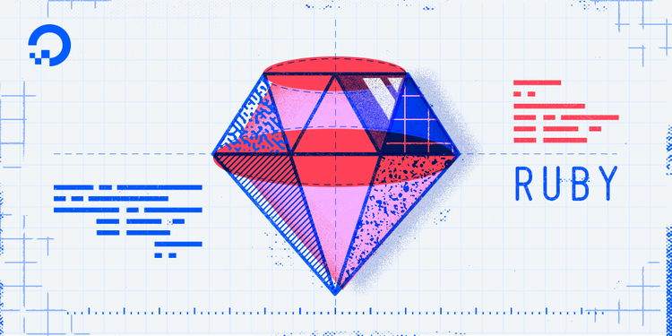

---

Sorting is a basic and extremely key component of algorithm study. Many other/higher algorithms rely on sorted lists to work better, so placing things in the correct order creates the foundation for a lot of problem-solving. We're going to skip over the more direct insertion and selection sorts to something that performs a little better: the merge sort.

Insertion, Selection, and even Quick sorts all have quadratic Big O's in the worst case O( n²). Merge sort clocks in at a better O( n log n) due to its divide and conquer paradigm. This type of sort works by dividing the original array into two arrays, which it then combines after having sorted them by also splitting those arrays, and those arrays, until it finds collections of single items, which it compares and combines, and then climbs back up the latter recombining. If that sounds like recursion, well, it is!
Image SourceSince the divide part is halving the total array length, and then halving that, etc., until we reach one, the time cost of the divide portion of this sort is log n. However, the merging, or conquering part of our strategy costs a little more. Merging is going to cost n for each division level in addition to the log n we're spending by splitting. So the merge portion is going to cost n log n, unfortunately higher than log n. Big O is based on worst case, so our merge sort Big O is actually going to be O( n log n).

Thinking about our overall strategy, we have 2 steps. First step is diving an array into smaller arrays until they are one element (i.e-already sorted), and then we need to merge them with adjacent lists back up until the formed the final, sorted array.
So for the divide part, it could look something like this.

If we run the above code in terminal feeding in an array of [7, 9, 8, 12, 11, 10] we get [7, 9, 8] and [12, 11, 10]. The split arrays are not ordered, but that does not matter because we are going to keep splitting into all we have are arrays of single elements. But for now, we know our dividing part of Divide & Conquer works. Before we dive into recursion, let's take a detour and work on the conquer part.
We want to build a method that given two arrays can merge them into one array in order. We will call it merge. There are multiple ways to do this, but remembering that given our overall strategy we are going to be comparing either single element sub-arrays, or already sorted sub-arrays, our job is easier.

The legwork to our merge sort is done. We just need to call the merge sort recursively on the original array, and use our merge method to merge all the divided sub-arrays back into one final, sorted array.

And there we have it! A functioning merge sort. It's a great way to order arrays. As I mentioned earlier, it's significantly faster that insertion and selection sorts. Quick sort on average is comparable, but it's worst-case is still O( n²), so let's give it up for merge sort!

---
